# Геометрия квартиры — задачник (5 класс)

Текст и чертежи сформированы из того же каталога, что и интерактивное приложение.

## Базовый

### Б1. Квадрат и коридор

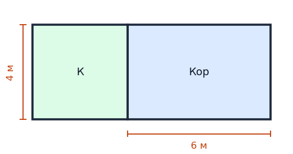

**Условие.** Квадратная комната имеет периметр 16 м. К ней примыкает коридор: его ширина равна стороне комнаты, а длина на 2 м больше стороны комнаты. Найдите площадь коридора.

**Решение.**
1. Сторона комнаты: 16 : 4 = 4 м.
2. Ширина коридора = 4 м, длина: 4 + 2 = 6 м.
3. Площадь коридора: S = 4 · 6 = 24 м².

**Ответ:** 24 м²

---

### Б2. Балкон

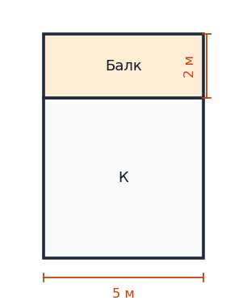

**Условие.** Квадратная комната имеет периметр 20 м. По одной стороне комнаты сделан прямоугольный балкон шириной 2 м и такой же длины, как сторона комнаты. Найдите площадь балкона.

**Решение.**
1. Сторона комнаты: 20 : 4 = 5 м.
2. Балкон: длина 5 м, ширина 2 м.
3. Площадь балкона: S = 5 · 2 = 10 м².

**Ответ:** 10 м²

---

### Б3. Коридор слева

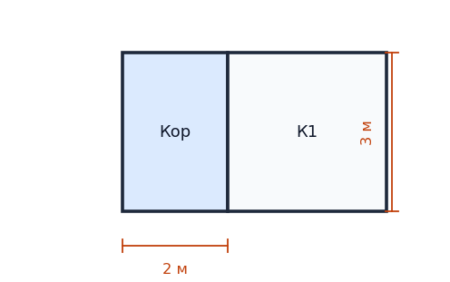

**Условие.** Комната 1 — квадрат с периметром 12 м. Слева от неё находится прямоугольный коридор длиной 2 м и такой же высоты, как комната. Найдите площадь коридора.

**Решение.**
1. Сторона комнаты: 12 : 4 = 3 м.
2. Коридор: высота 3 м, длина 2 м.
3. Площадь коридора: S = 3 · 2 = 6 м².

**Ответ:** 6 м²

---

### Б4. Коридор вдоль стороны

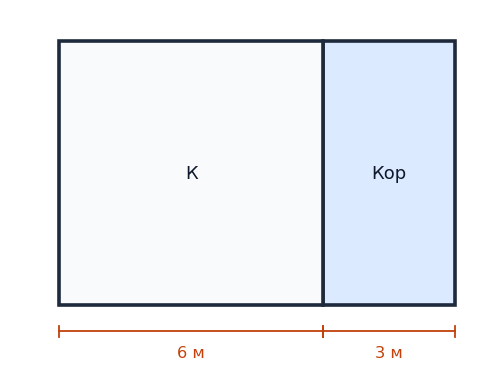

**Условие.** Квадратная комната имеет периметр 24 м. Вдоль одной её стороны проходит коридор шириной 3 м и длиной, равной стороне комнаты. Найдите площадь коридора.

**Решение.**
1. Сторона комнаты: 24 : 4 = 6 м.
2. Коридор: 6 м × 3 м.
3. Площадь коридора: S = 6 · 3 = 18 м².

**Ответ:** 18 м²

---

### Б5. Две комнаты и коридор

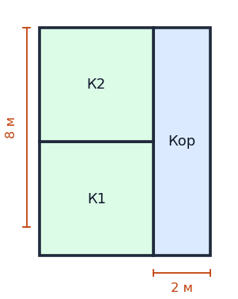

**Условие.** Комната 1 и Комната 2 — квадраты 4×4 м. Справа — прямоугольный коридор высотой 8 м и шириной 2 м. Найдите площадь коридора.

**Решение.**
1. Общая высота слева: 4 + 4 = 8 м.
2. Коридор: 8 м × 2 м.
3. Площадь коридора: S = 8 · 2 = 16 м².

**Ответ:** 16 м²

---

## Средний

### С1. Три комнаты

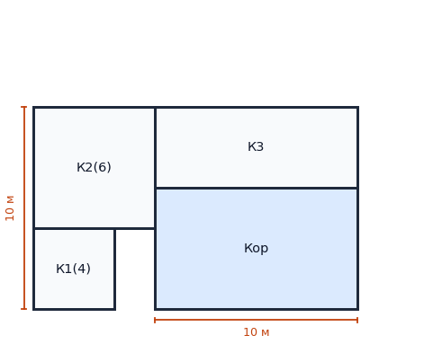

**Условие.** Комната 1 — квадрат с периметром 16 м, снизу слева. Над ней квадратная комната 2 со стороной 6 м (левый столбец шириной 6 м, как на плане). Справа столбец шириной 10 м; высота всей квартиры 10 м. Сверху комната 3 размером 10×4 м, под ней — коридор. Найдите площадь коридора.

**Решение.**
1. Сторона К1: 16 : 4 = 4 м.
2. Общая высота слева: 4 + 6 = 10 м.
3. Комната 3 на плане имеет высоту 4 м, значит под ней коридор высотой 10 − 4 = 6 м; ширина столбца 10 м.
4. Площадь коридора: S = 6 · 10 = 60 м².

**Ответ:** 60 м²

---

### С2. Периметр и коридор

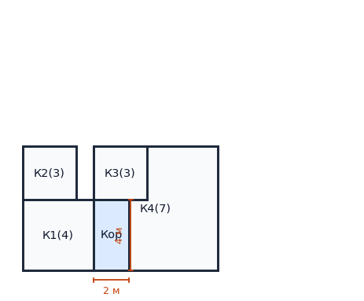

**Условие.** Комната 1 — квадрат с периметром 16 м, снизу слева. Над ней квадратная комната 2. Справа квадратная комната 4 с периметром 28 м. Над коридором расположена квадратная комната 3. Все комнаты квадратные. Найдите площадь коридора.

**Решение.**
1. К1: P=16 → a1=4 м. К4: P=28 → a4=7 м.
2. Высота квартиры 7 м. Тогда сторона К2: a2 = 7 − 4 = 3 м.
3. Комната 3 тоже 3×3, коридор под ней высотой 4 м и шириной 2 м.
4. Площадь коридора: S = 4 · 2 = 8 м².

**Ответ:** 8 м²

---

### С3. Две комнаты и узкий коридор

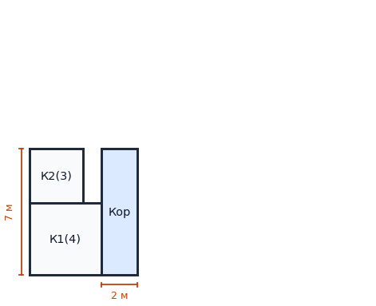

**Условие.** Комната 1 — квадрат с периметром 16 м. Над ней квадратная комната 2 с периметром 12 м (стороны выровнены по левому краю, как на плане). Справа — коридор шириной 2 м на всю высоту квартиры. Найдите площадь коридора.

**Решение.**
1. Сторона К1: 16 : 4 = 4 м.
2. Сторона К2: 12 : 4 = 3 м.
3. Высота квартиры слева: 4 + 3 = 7 м — это высота коридора.
4. Площадь коридора: S = 2 · 7 = 14 м².

**Ответ:** 14 м²

---

### С4. Две комнаты слева и блок справа

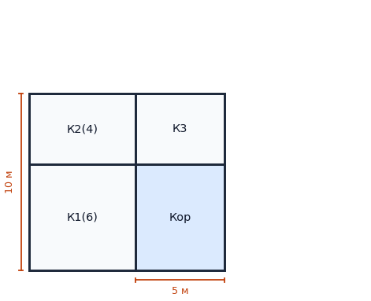

**Условие.** Комната 1 — квадрат с периметром 24 м. Над ней квадратная комната 2 с периметром 16 м. Справа сверху прямоугольная комната 3 размером 5×4 м, под ней — коридор на всю ширину 5 м. Высота всей квартиры 10 м. Найдите площадь коридора.

**Решение.**
1. Сторона К1: 24 : 4 = 6 м.
2. Сторона К2: 16 : 4 = 4 м.
3. Высота слева: 6 + 4 = 10 м — совпадает с условием.
4. Комната 3 высотой 4 м, значит под ней коридор высотой 10 − 4 = 6 м.
5. Площадь коридора: S = 5 · 6 = 30 м².

**Ответ:** 30 м²

---

### С5. Коридор и комната 3

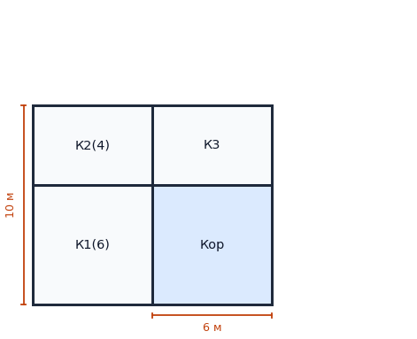

**Условие.** Комната 1 — квадрат со стороной 6 м. Над ней квадратная комната 2 со стороной 4 м. Справа от комнаты 1 и комнаты 2 расположены два прямоугольника одинаковой ширины: верхний — комната 3 (6×4 м), нижний — коридор. Высота всей квартиры 10 м. Найдите площадь коридора.

**Решение.**
1. Высота слева: 6 + 4 = 10 м — совпадает с общей высотой.
2. Комната 3 высотой 4 м, значит под ней остаётся 10−4=6 м — высота коридора.
3. Ширина коридора = 6 м.
4. Площадь коридора: S = 6 · 6 = 36 м².

**Ответ:** 36 м²

---

### С6. Периметры 12 м и 20 м

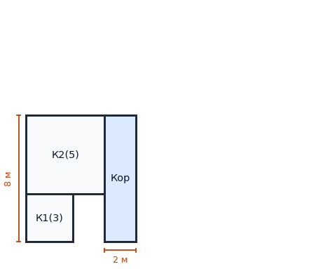

**Условие.** Нижняя левая комната — квадрат с периметром 12 м. Над ней квадратная комната 2 с периметром 20 м (общий левый край, ширина колонки 5 м, как на плане). Справа коридор шириной 2 м на всю высоту квартиры. Найдите площадь коридора.

**Решение.**
1. Сторона К1: 12 : 4 = 3 м.
2. Сторона К2: 20 : 4 = 5 м.
3. Высота квартиры: 3 + 5 = 8 м.
4. Площадь коридора: S = 2 · 8 = 16 м².

**Ответ:** 16 м²

---

### С7. Маленькая комната сверху

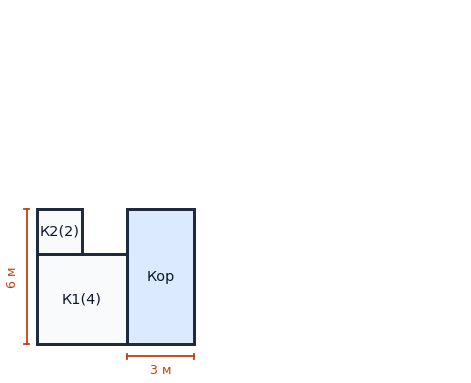

**Условие.** Комната 1 — квадрат с периметром 16 м. Над ней квадратная комната 2 с периметром 8 м (левый нижний угол комнаты 2 совпадает с левым верхним углом комнаты 1). Справа коридор шириной 3 м на всю высоту квартиры. Найдите площадь коридора.

**Решение.**
1. Сторона К1: 16 : 4 = 4 м.
2. Сторона К2: 8 : 4 = 2 м.
3. Высота квартиры: 4 + 2 = 6 м.
4. Площадь коридора: S = 3 · 6 = 18 м².

**Ответ:** 18 м²

---

### С8. Три квадрата в два столбца

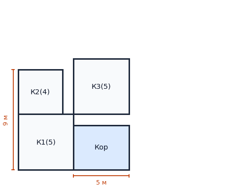

**Условие.** Комната 1 — квадрат со стороной 5 м. Над ней квадратная комната 2 со стороной 4 м. Справа сверху квадратная комната 3 со стороной 5 м, под ней — коридор на всю ширину 5 м. Найдите площадь коридора.

**Решение.**
1. Высота слева: 5 + 4 = 9 м — общая высота квартиры.
2. Комната 3 со стороной 5 м занимает верхние 5 м справа, под ней остаётся 9 − 5 = 4 м — высота коридора.
3. Площадь коридора: S = 5 · 4 = 20 м².

**Ответ:** 20 м²

---

### С9. Два столбца разной ширины

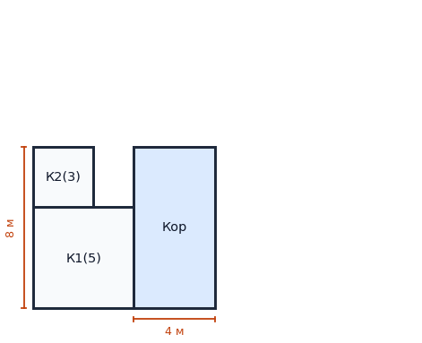

**Условие.** Комната 1 — квадрат с периметром 20 м. Над ней квадратная комната 2 с периметром 12 м (как на плане). Справа — коридор шириной 4 м на всю высоту квартиры. Найдите площадь коридора.

**Решение.**
1. Сторона К1: 20 : 4 = 5 м.
2. Сторона К2: 12 : 4 = 3 м.
3. Высота квартиры: 5 + 3 = 8 м.
4. Площадь коридора: S = 4 · 8 = 32 м².

**Ответ:** 32 м²

---

### С10. Прямоугольник и коридор

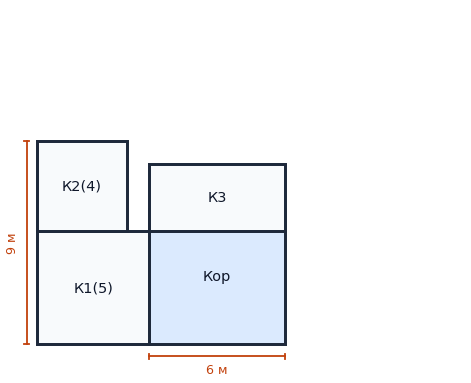

**Условие.** Комната 1 — квадрат со стороной 5 м. Над ней квадратная комната 2 со стороной 4 м. Справа сверху прямоугольная комната 3 размером 6×3 м, под ней — коридор на всю ширину 6 м. Найдите площадь коридора.

**Решение.**
1. Высота слева: 5 + 4 = 9 м — общая высота квартиры.
2. Комната 3 высотой 3 м, значит высота коридора: 9 − 3 = 6 м.
3. Ширина коридора 6 м.
4. Площадь коридора: S = 6 · 6 = 36 м².

**Ответ:** 36 м²

---

## Продвинутый

### П1. Выражение через P1

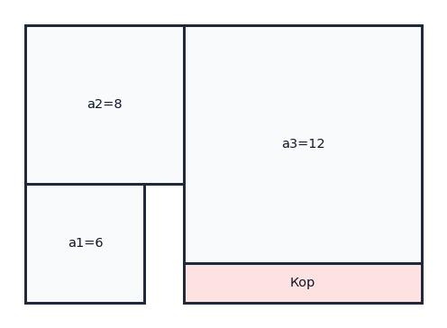

**Условие.** Комната 1 — квадрат, её периметр P1. Над ней квадратная комната 2, периметр которой на 8 м больше. Справа квадратная комната 3, её периметр на 16 м больше, чем у комнаты 2. Под комнатой 3 — коридор. Выразите площадь коридора через P1. (На чертеже — пример при a1 = 6 м.)

**Решение.**
1. Пусть сторона комнаты 1: a1 = P1 / 4.
2. Тогда a2 = a1 + 2, a3 = a2 + 4 = a1 + 6.
3. Высота слева: a1 + a2 = 2a1 + 2.
4. Высота коридора: (2a1 + 2) − (a1 + 6) = a1 − 4.
5. Ширина коридора: a3 = a1 + 6.
6. Площадь коридора: S = (a1 − 4)(a1 + 6).

**Ответ:** S = (a1 − 4)(a1 + 6)

---

### П2. Восстановление плана

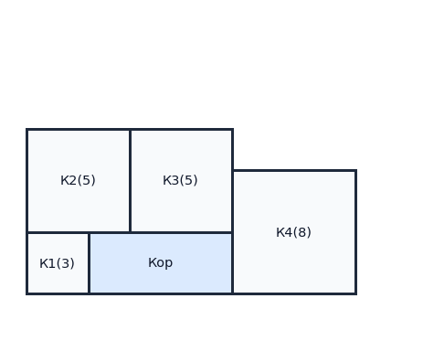

**Условие.** Высота коридора 3 м, его площадь 21 м². Комната 1 — квадрат 3×3, находится внизу слева. По этим данным восстановите периметры остальных квадратных комнат, если план как на рисунке.

**Решение.**
1. Высота коридора: 3 м, площадь 21 м² → длина коридора 7 м.
2. Снизу: справа от К1 (3 м) ещё 7 м коридора → всего 10 м.
3. Сверху над ними две комнаты по 5 м (К2 и К3), их периметры по 20 м.
4. Правая большая комната К4 имеет сторону 8 м (по рисунку) и периметр 32 м.
5. Итого периметры: К1 — 12 м, К2 — 20 м, К3 — 20 м, К4 — 32 м.

**Ответ:** Периметры: 12, 20, 20, 32 м.

---

### П3. Стороны комнат 2 и 3

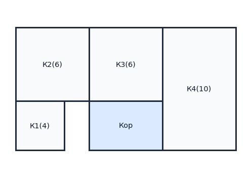

**Условие.** Комната 4 — квадрат, её периметр 40 м. Слева снизу — квадратная комната 1 с периметром 16 м, над ней квадратная комната 2, справа над коридором — квадратная комната 3. Найдите стороны комнат 2 и 3 и площадь коридора.

**Решение.**
1. К1: P=16 → a1=4 м. К4: P=40 → a4=10 м.
2. Высота квартиры 10 м. Тогда сторона К2: a2 = 10 − 4 = 6 м.
3. Комната 3 — квадрат, возьмём сторону a3 = 6 м.
4. Коридор под К3: высота 4 м, ширина 6 м.
5. Площадь коридора: S = 4 · 6 = 24 м².

**Ответ:** a2=6 м, a3=6 м, S=24 м²

---

### П4. Переменная a

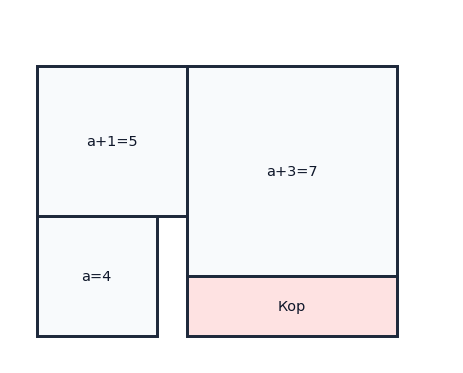

**Условие.** Комната 1 — квадрат, её сторона a метров. Над ней квадратная комната 2 со стороной a+1 м. Справа от комнаты 2 — квадратная комната 3 со стороной a+3 м, под ней — коридор. Общая высота квартиры равна 2a+1 м. Найдите площадь коридора через a. (На чертеже — пример при a = 4 м.)

**Решение.**
1. Высота слева: a + (a+1) = 2a+1 — совпадает с общей высотой.
2. Справа: комната 3 высотой a+3.
3. Высота коридора: (2a+1) − (a+3) = a−2.
4. Ширина коридора: a+3.
5. Площадь: S = (a−2)(a+3).

**Ответ:** S = (a−2)(a+3)

---

### П5. Три квадрата и коридор

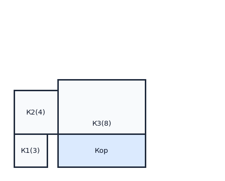

**Условие.** В квартире три квадратные комнаты и коридор. Нижняя левая комната имеет периметр 12 м, верхняя левая — периметр 16 м, правая — периметр 32 м. Коридор занимает нижнее правое место и его высота равна высоте нижней левой комнаты. Найдите площадь коридора.

**Решение.**
1. Нижняя левая: P=12 → сторона 3 м.
2. Верхняя левая: P=16 → сторона 4 м.
3. Правая комната: P=32 → сторона 8 м.
4. Высота коридора = 3 м, ширина = 8 м.
5. Площадь коридора: S = 3 · 8 = 24 м².

**Ответ:** 24 м²

---

## Сводная таблица ответов

| Задача | Ответ |
| --- | --- |
| B1 | 24 м² |
| B2 | 10 м² |
| B3 | 6 м² |
| B4 | 18 м² |
| B5 | 16 м² |
| C1 | 60 м² |
| C2 | 8 м² |
| C3 | 14 м² |
| C4 | 30 м² |
| C5 | 36 м² |
| C6 | 16 м² |
| C7 | 18 м² |
| C8 | 20 м² |
| C9 | 32 м² |
| C10 | 36 м² |
| P1 | S = (a1 − 4)(a1 + 6) |
| P2 | Периметры: 12, 20, 20, 32 м. |
| P3 | a2=6 м, a3=6 м, S=24 м² |
| P4 | S = (a−2)(a+3) |
| P5 | 24 м² |
