# Тренажер пропорций и площадей — задачник (5 класс)

Материал сформирован автоматически из интерактивного тренажера.

## Уровень 1

### Задача 1. Базовый 1

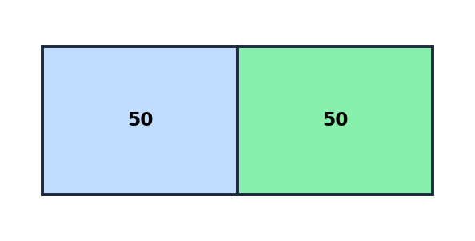

**Условие.** Прямоугольник площадью 100 см² разрезали на 2 равные части. Во сколько раз площадь целого больше площади одной части?

**Решение.** 100 ÷ 2 = 50. Целое 100, часть 50, значит в 2 раза.

**Ответ:** 2 раза

---

### Задача 2. Базовый 2

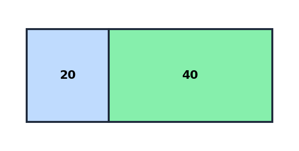

**Условие.** Площадь 60 см², одна часть в 2 раза больше другой. Найдите площади обеих частей (введите через запятую).

**Решение.** Отношение 1:2, всего 3 части. 60 ÷ 3 = 20. Части: 20 и 40.

**Ответ:** 20 см² и 40 см²

---

### Задача 3. Базовый 3

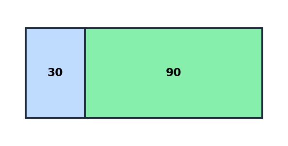

**Условие.** Площадь 120 см² разделили в отношении 1:3. Найдите площадь большей части.

**Решение.** Всего 4 части, 120 ÷ 4 = 30. Большая: 30 × 3 = 90.

**Ответ:** 90 см²

---

### Задача 4. Базовый 4

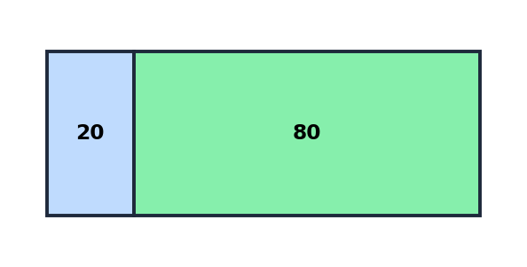

**Условие.** Одна часть 20 см², вторая в 4 раза больше. Найдите площадь целого прямоугольника.

**Решение.** Отношение 1:4, всего 5 частей. Если 1 часть = 20, то целое 20 × 5 = 100.

**Ответ:** 100 см²

---

### Задача 5. Базовый 5

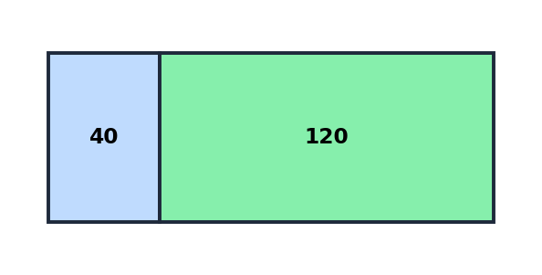

**Условие.** Большая часть 120 см² и она в 3 раза больше меньшей. Найдите общую площадь.

**Решение.** 120 = 3 части, 1 часть = 40. Всего 4 части: 40 × 4 = 160.

**Ответ:** 160 см²

---

## Уровень 2

### Задача 6. Средний 6

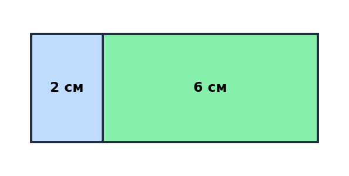

**Условие.** Прямоугольник 8×15 см разрезали по короткой стороне в отношении 1:3. Найдите площади фигур (через запятую).

**Решение.** 8 делим на 4: 2 и 6. Площади: 15×2=30 и 15×6=90.

**Ответ:** 30 см² и 90 см²

---

### Задача 7. Средний 7

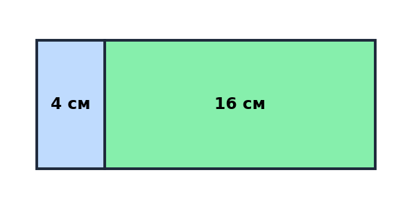

**Условие.** Прямоугольник 10×20 см разрезали вдоль длинной стороны в отношении 1:4. Найдите площадь меньшей части.

**Решение.** 20 делим на 5, меньшая ширина 4. Площадь: 10×4 = 40.

**Ответ:** 40 см²

---

### Задача 8. Средний 8

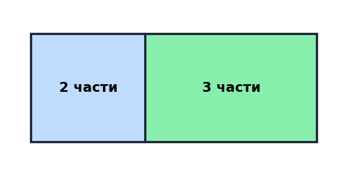

**Условие.** Площадь 180 см², сторона 10 см. Разрез в отношении 2:3. Найдите площади частей (через запятую).

**Решение.** По ключу: площади частей 72 см² и 108 см².

**Ответ:** 72 см² и 108 см²

---

### Задача 9. Средний 9

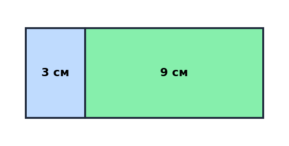

**Условие.** Квадрат 12×12 разрезали в отношении 1:3. Введите площади двух фигур (через запятую).

**Решение.** 12 делим на 4: 3 и 9. Площади 12×3=36 и 12×9=108.

**Ответ:** 36 см² и 108 см²

---

### Задача 10. Средний 10

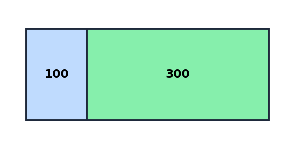

**Условие.** Площадь прямоугольника 400 см². Одна часть — квадрат 10×10. Во сколько раз вторая часть больше первой?

**Решение.** Первая 100, вторая 300. 300 ÷ 100 = 3.

**Ответ:** 3 раза

---

## Уровень 3

### Задача 11. Сложный 11

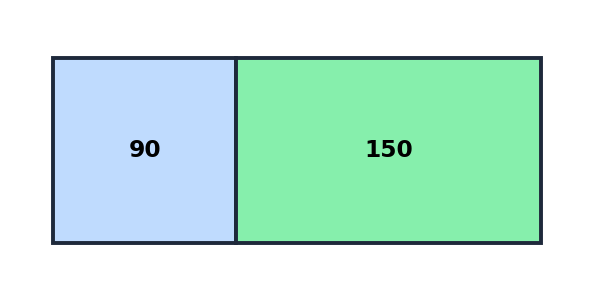

**Условие.** Площади частей относятся как 3:5, разница 40 см². Найдите площадь всего прямоугольника.

**Решение.** По ключу тренажера ответ: 240 см².

**Ответ:** 240 см²

---

### Задача 12. Сложный 12

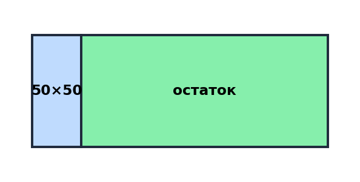

**Условие.** Прямоугольник 300×50 см, одна часть — квадрат 50×50. Найдите площадь второй части.

**Решение.** Общая 15000, квадрат 2500, остаток 14500.

**Ответ:** 14500 см²

---

### Задача 13. Сложный 13

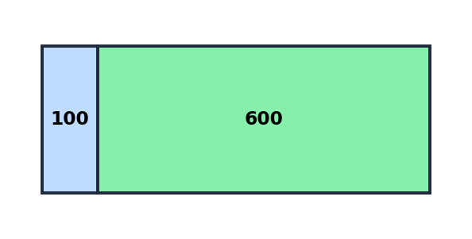

**Условие.** Разрез в отношении 1:6. Большая часть на 100 см² больше меньшей. Найдите общую площадь.

**Решение.** По ключу тренажера ответ: 700 см².

**Ответ:** 700 см²

---

### Задача 14. Сложный 14

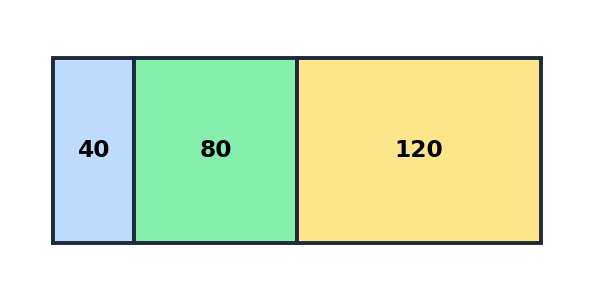

**Условие.** Три части: первая в 2 раза больше второй, третья равна сумме первых двух. Общая площадь 240. Найдите все части (через запятую).

**Решение.** Пусть вторая x, тогда первая 2x, третья 3x. 6x=240 => x=40.

**Ответ:** 40 см², 80 см², 120 см²

---

### Задача 15. Бонус 15

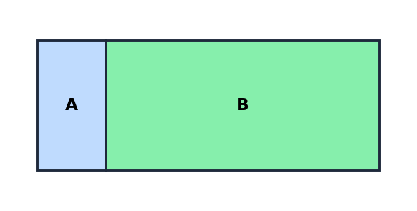

**Условие.** Если площадь A увеличить в 5 раз, получится площадь всего прямоугольника. Какую часть от целого составляет B? (можно 0.8 или 80)

**Решение.** 5A = S = A + B => B = 4A. Тогда B/S = 4/5 = 0.8 = 80%.

**Ответ:** 4/5 (80%)

---

## Сводная таблица ответов

| Задача | Ответ |
| --- | --- |
| 1 | 2 раза |
| 2 | 20 см² и 40 см² |
| 3 | 90 см² |
| 4 | 100 см² |
| 5 | 160 см² |
| 6 | 30 см² и 90 см² |
| 7 | 40 см² |
| 8 | 72 см² и 108 см² |
| 9 | 36 см² и 108 см² |
| 10 | 3 раза |
| 11 | 240 см² |
| 12 | 14500 см² |
| 13 | 700 см² |
| 14 | 40 см², 80 см², 120 см² |
| 15 | 4/5 (80%) |
